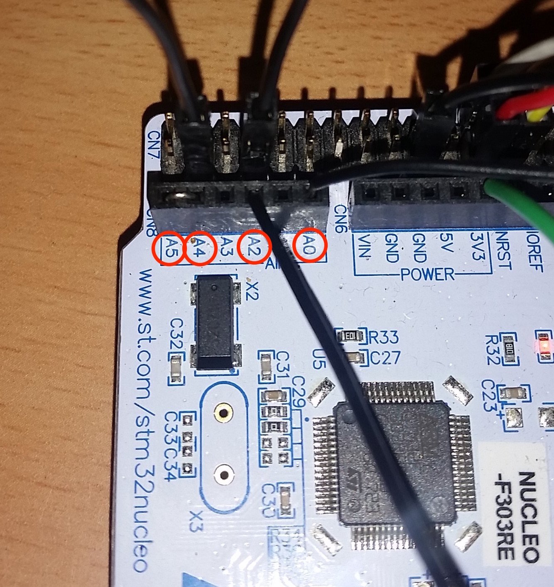

#### Emon3CT

Pinout for inputs.

|  VT Input |  CT Input |
|--:|---|
|A0|A2, A4, A5|

| BiasInput |  BiasOutput |
|--:|---|
|D11|D12|

The bias input is Vcc/2.

See prototype1 doco [here](../doco/prototype1.md).  
