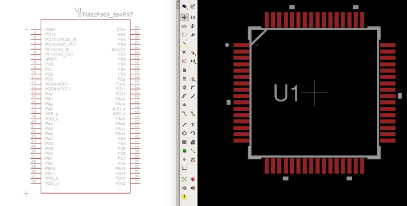

## STM32 Hardware 01

See forum posts:

- [https://community.openenergymonitor.org/t/stm32-hardware-development/7135/18](https://community.openenergymonitor.org/t/stm32-hardware-development/7135/18)
- [https://community.openenergymonitor.org/t/stm32-hardware-development/7135/26](https://community.openenergymonitor.org/t/stm32-hardware-development/7135/26)

First outline of an STM32 design. STM32F303 64pin as a starting point.

The design so far:

- STM32F303RET 64pin
- 5V to 3V3 Voltage regulator [MCP1825 500mA](http://ww1.microchip.com/downloads/en/devicedoc/22056b.pdf) (enough for an ESP8266 I think)
- Decoupling capacitors on supply inputs as in AN4206 best practice guidelines. 
- Oscillator 
- ST Link Header
- UART Header
- USB DFU (needs testing as above)
- Battery holder footprint for RTC?
- Jumper for BOOT0

Further questions:

1. VREG Datasheet suggests minimum 1uF Output Capacitor, STM32 Hardware Guide suggests 4.7uF on VDD and 1uF on VDDA. Should I add all three in locations close to the respective components or is a 4.7uF capacitor near the voltage regulator sufficient.
2. Oscillator frequency?
3. I've used a couple of solder jumpers for the RTC Battery / 3V3 supply selector, would a 3pin throughhole header be better (not likely a configuration that will change regularly in a design - solder jumper should be fine and keeps things compact).
4. ST-Link connector pin out I copied from Ken's ARMiGO design, the order is different from the SWD connector on the ST-LINK board, is there a standard to adhere too?
5. Should UART reset connect to NRST somehow? BOOT0  needs to be pulled high and board reset for serial upload to work, inserting a jumper and power cycling the board worked fine in testing above, is there value in automating this step?
6. USB DFU needs testing, Nucleo reference design has a transistor and 3 resistors connecting the 1k5 pull up to USB_RENUm, The ARMiGO design does not have this, is it needed? Same goes for the 22pF capacitors.

**STM32 Eagle libraries**

Perhaps the easiest way to get the eagle components for the STM32 range is to use the STM provided bxl CAD fiiles and the recommended route of using the https://app.ultralibrarian.com online tool that can export these bxl files into a variety of formats used by common electronic design tools such as Eagle or KiKad.

Download: [stm32f303.lbr](stm32f303.lbr)

The CAD files downloadable from STM also include files for f303 100pin and 144pin designs. The xls file *Select_BXLfile.xls* details which bxl file to use.
