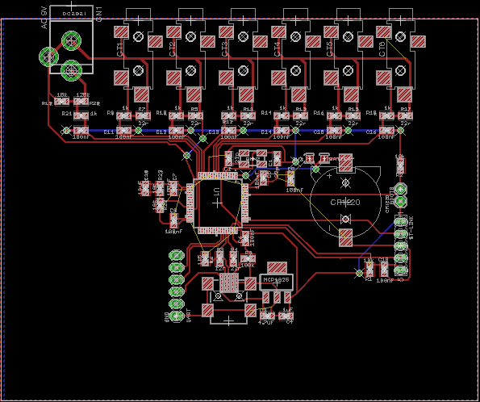

## STM32 Hardware 02

See forum posts:

- [https://community.openenergymonitor.org/t/stm32-hardware-development/7135/18](https://community.openenergymonitor.org/t/stm32-hardware-development/7135/18)
- [https://community.openenergymonitor.org/t/stm32-hardware-development/7135/26](https://community.openenergymonitor.org/t/stm32-hardware-development/7135/26)

The design so far:

- STM32F303RET 64pin
- 5V to 3V3 Voltage regulator [MCP1825 500mA](http://ww1.microchip.com/downloads/en/devicedoc/22056b.pdf) (enough for an ESP8266 I think)
- Decoupling capacitors on supply inputs as in AN4206 best practice guidelines. 
- Oscillator 
- ST Link Header
- UART Header
- USB DFU (needs testing as above)
- Battery holder footprint for RTC?
- Jumper for BOOT0

In addition to stm32hw01:

- 6x CT inputs all on ADC1
- 1x ACAC Voltage input on ADC4

### Schematic

### Board

