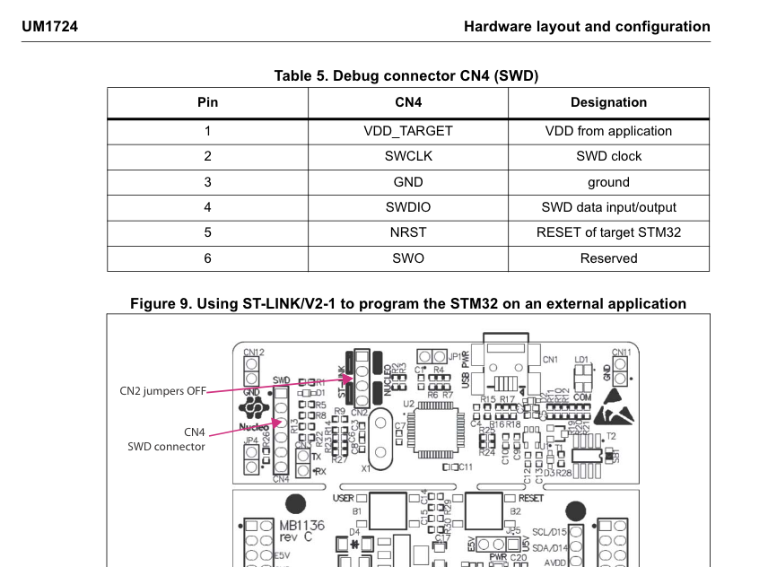
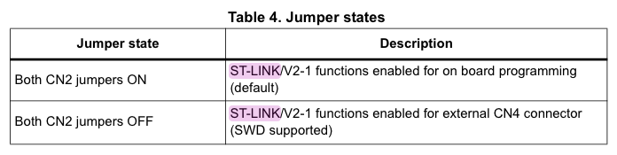
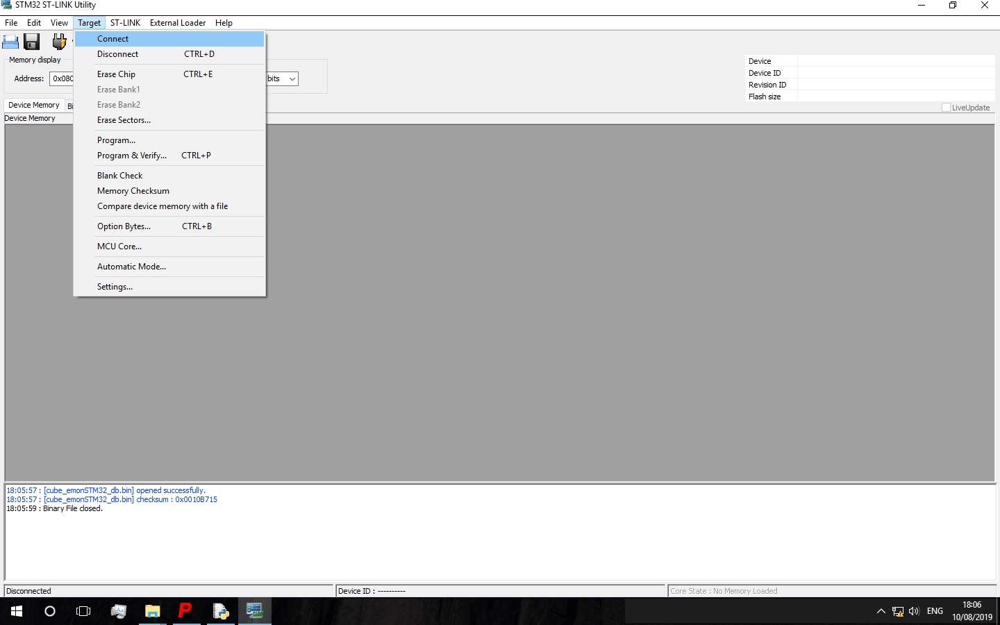
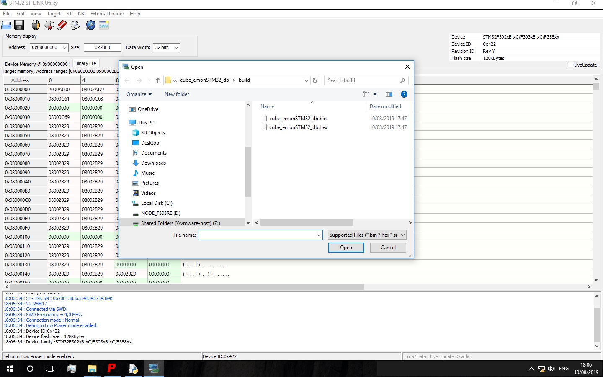
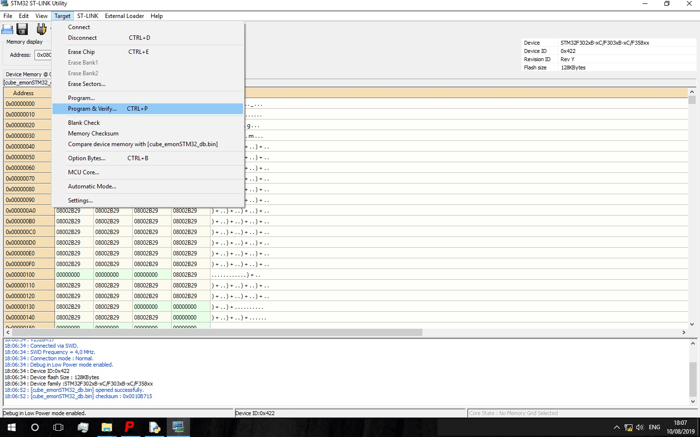
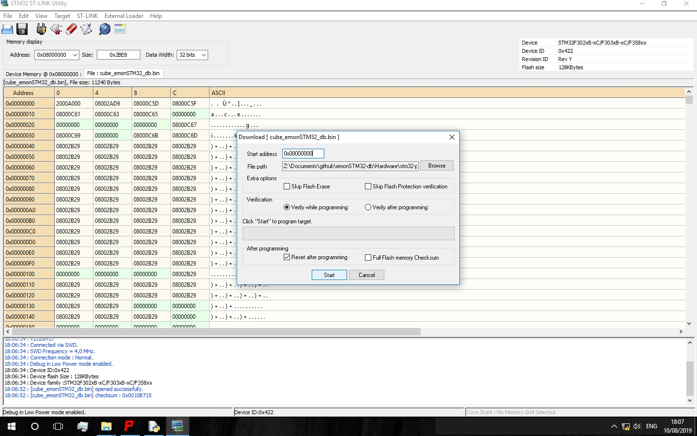
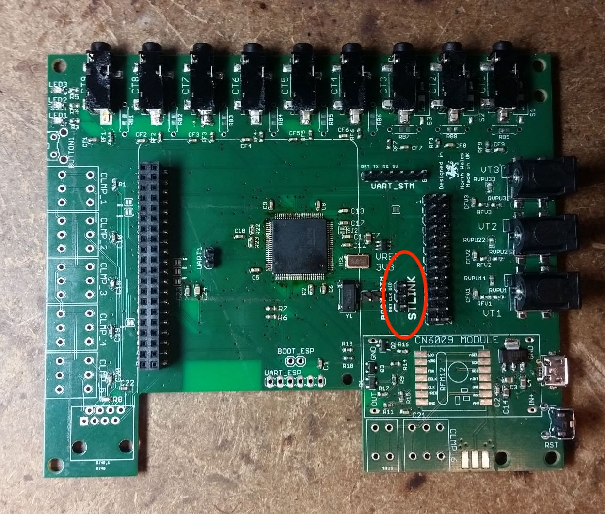

## Flashing a fresh chip

To program a new chip, an ST-Link/V2 programmer can be used. This can be a stand alone USB device, or in this case the ST-Link part of a nucleo dev board.

Full doco on this can be found in ST's UM1724.

Here's how I've done it.

The two jumpers on the ST-link(nucleo) at CN2 must be removed.

The CN4 (SWD) header must be connected to the chip's ST-link designated pins. These are JTCK, JTMS, and NRST.

Here's the CN4 pinout:
1.    n/a
2.    T_JTCK: Clock signal of target CPU, connects to PA14 on STM32
3.    GND, connects to GND
4.    T_JTMS: -> SWD data input/output, PA13 on the STM32
5.    T_NRST: Reset -> NRST on the STM32
6.    T_SWO: Single Wire Output -> PB3 (Optional, not needed for firmware upload, used for output)

Only the three pins JTCK, JTMS, and NRST, plus power and GND from somewhere, require connecting. For our dev board I took power from the micro USB connector.

Once connected the next step was to install  on a Windows virtual machine.

See also:
https://community.particle.io/t/how-to-flash-a-brand-new-freshly-soldered-stm32f103-chip/3906/8