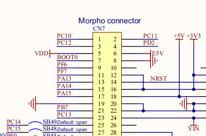

**ST-LINK JTAG/SWD Firmware Upload**

The nucleo development boards come with an integrated ST-Link-v2 programming board that you can snap off. 

> The ST-LINK/V2 is an in-circuit debugger and programmer for the STM8 and STM32 microcontroller families. The single wire interface module (SWIM) and JTAG/serial wire debugging (SWD) interfaces are used to communicate with any STM8 or STM32 microcontroller located on an application board.

ST-LINK-V2: http://www.st.com/en/development-tools/st-link-v2.html

Alternatively you can buy cheap [ST-Link-v2 programmers on ebay](https://www.ebay.co.uk/itm/ST-Link-V2-Emulator-Downloader-Programmer-STM32F103C8T6-STM8-STM32-w-Cable/302106332464?hash=item4656f0cd30:g:yq4AAOSwNRdYAEmj) that avoid the need to add the full st-link programmer hardware to a STM32 hardware design. Ken's ARMiGO design above has a 5-pin connector for programming with an external ST-LINK programmer.

In order to further my understanding of the hardware part of st-link firmware upload, I snapped off the st-link adapter on my nucleo development board and then following the pin out as documented on the schematic for the nucleo rewired both parts together: 

Download the nucleo f303re schematic here:
[http://www.st.com/resource/en/schematic_pack/nucleo_64pins_sch.zip](http://www.st.com/resource/en/schematic_pack/nucleo_64pins_sch.zip)

The 6-pin SWD connector can be seen on the left of the ST-link adapter board.

**Pins**
1. n/a
2. T_JTCK: Clock signal of target CPU, connects to PA14 on STM32
3. GND, connects to GND
4. T_JTMS: -> SWD data input/output, PA13 on the STM32 
5. T_NRST: Reset -> NRST on the STM32
6. T_SWO: Single Wire Output -> PB3 (Optional, not needed for firmware upload, used for output)

Then on the nucleo development board part, the schematic indicates the position of PA14, PA13, NRST, 3V3 & GND:

3V3 power for the nucleo STM32 board can be accessed from JP1 on the ST-link programmer.

Picture of the connected boards:

and firmware upload worked just the same as pre snapping off the ST-link board :)
