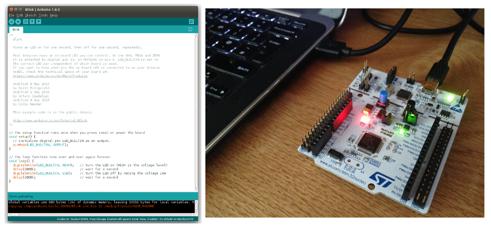
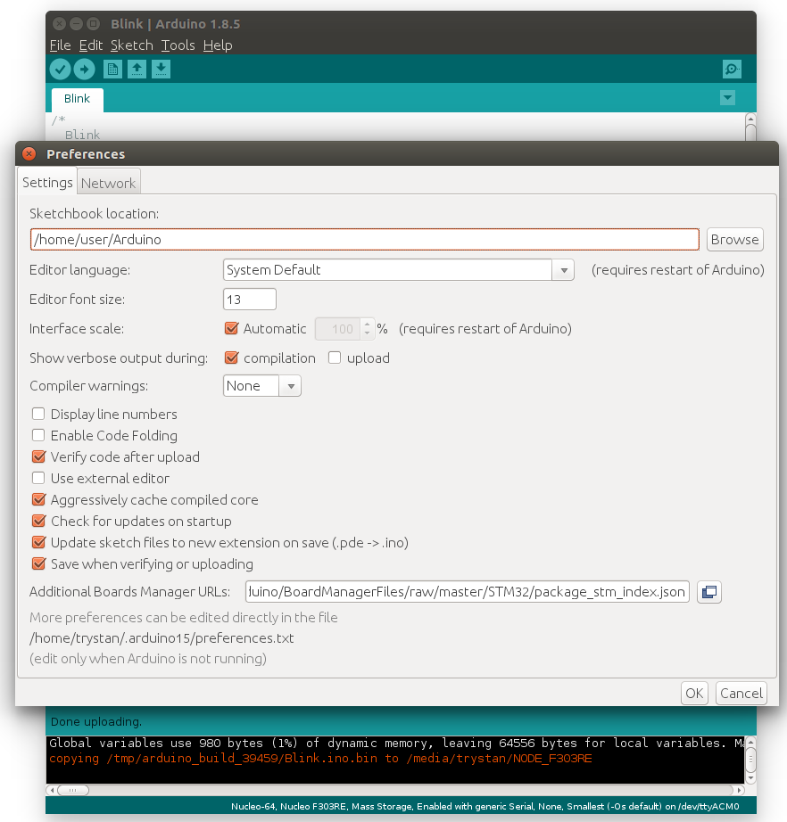
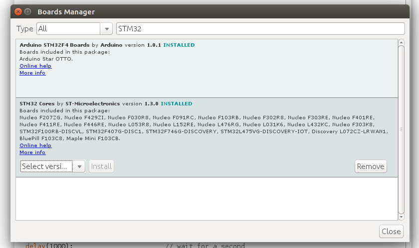
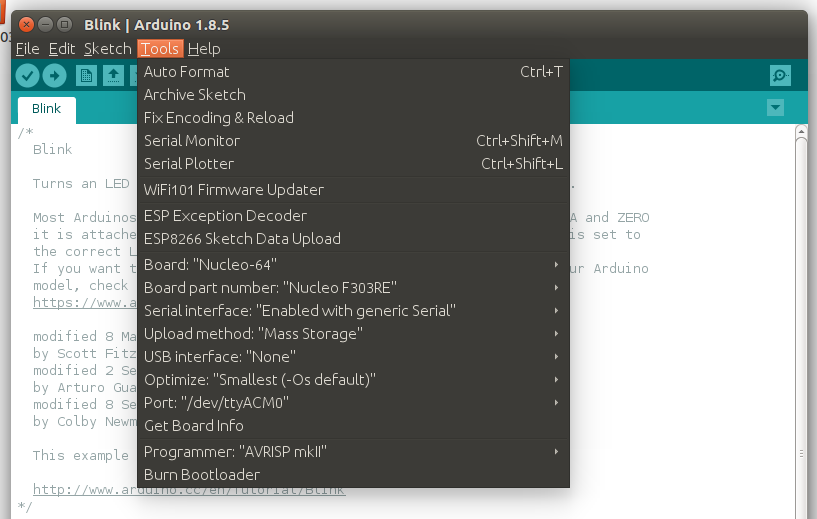

# Blinking an LED using the NUCLEO-F303RE Development board & STM32Duino

**You will need:**

- [Arduino IDE](https://www.arduino.cc/en/Main/Software)
- NUCLEO-F303RE Development board (e.g [From farnell £8.69](https://uk.farnell.com/stmicroelectronics/nucleo-f303re/dev-board-st-link-nucleo/dp/2467271))

**1) Open Blink example: File > Examples > 01.Basics > Blink**

**2) Install the STM32Duino core in the Arduino IDE.** Open File > Preferences. Enter the following URL in the Additional Boards Manager URLs box:

    https://github.com/stm32duino/BoardManagerFiles/raw/master/STM32/package_stm_index.json
    

Click ok to complete.
    
**3) Navigate to Tools > Board > Boards Manager and search for STM32 Cores and install**

**4) Under Tools select Board: Nucleo-64 & Part number: Nucleo F303RE:**

**5) Compile and upload.** The on-board LED should now blink once a second. Try increasing the blink speed by reducing the delay in the example sketch.

Next: [Basic NUCLEO-F303RE energy monitor using an EmonTxShield & EmonLib discreet sampling STM32Duino library.](https://github.com/TrystanLea/STM32Dev/blob/master/docs/STM32Duino/EmonLib.md)

