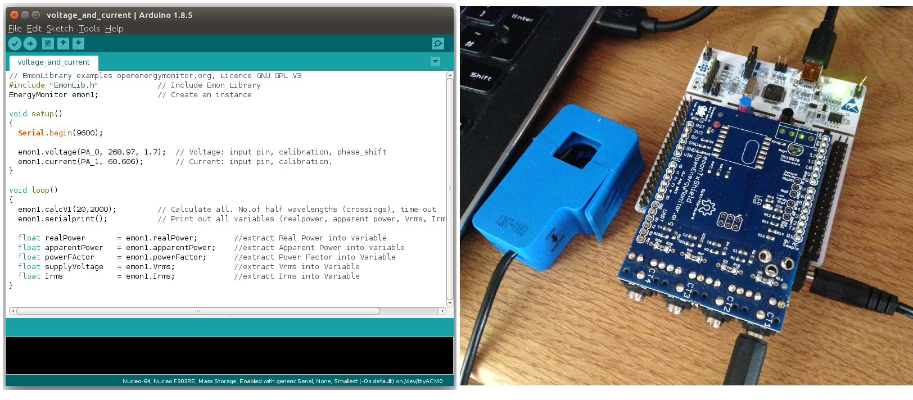

# Basic NUCLEO-F303RE energy monitor using an EmonTxShield & EmonLib discreet sampling STM32Duino library

Original forum thread: [https://community.openenergymonitor.org/t/stm32-development/6815/4](https://community.openenergymonitor.org/t/stm32-development/6815/4)

**You will need:**

- [Arduino IDE](https://www.arduino.cc/en/Main/Software)
- NUCLEO-F303RE Development board (e.g [From farnell £8.69](https://uk.farnell.com/stmicroelectronics/nucleo-f303re/dev-board-st-link-nucleo/dp/2467271))
- EmonTxShield or breadboard energy monitor circuit such as the one in this guide but replacing the Arduino with the STM32 development board [How to build an Arduino energy monitor - measuring mains voltage and current](https://learn.openenergymonitor.org/electricity-monitoring/ctac/how-to-build-an-arduino-energy-monitor)

**1) Remove the 5v pin from the EmonTxShield and put a solder jumper across from 3.3v to 5v:

**2) Download EmonLib**

Clone EmonLib into your Arduino libraries folder using git (or download from [here](http://github.com/openenergymonitor/EmonLib)).

    git clone https://github.com/openenergymonitor/EmonLib.git

**3) Change to STM32 branch**

    cd EmonLib
    git checkout STM32
    
**4) Open example 'voltage_and_current'.

