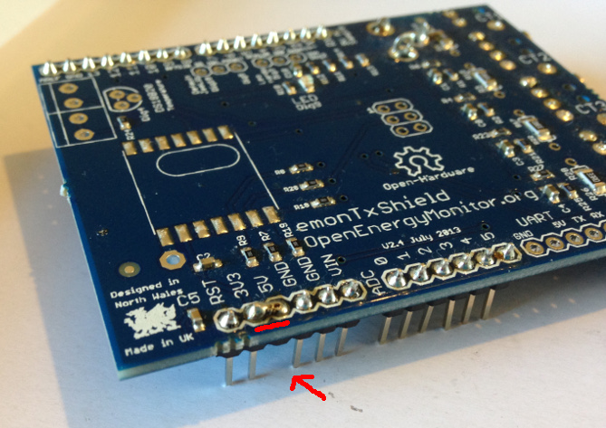

# Basic NUCLEO-F303RE energy monitor using an EmonTxShield & EmonLib discreet sampling STM32Duino library

Original forum thread: [https://community.openenergymonitor.org/t/stm32-development/6815/4](https://community.openenergymonitor.org/t/stm32-development/6815/4)

**You will need:**

- [Arduino IDE](https://www.arduino.cc/en/Main/Software)
- NUCLEO-F303RE Development board (e.g [From farnell £8.69](https://uk.farnell.com/stmicroelectronics/nucleo-f303re/dev-board-st-link-nucleo/dp/2467271))
- EmonTxShield or breadboard energy monitor circuit such as the one in this guide but replacing the Arduino with the STM32 development board [How to build an Arduino energy monitor - measuring mains voltage and current](https://learn.openenergymonitor.org/electricity-monitoring/ctac/how-to-build-an-arduino-energy-monitor)

**1) Remove the 5v pin from the EmonTxShield and put a solder jumper across from 3.3v to 5v:**

**2) Download EmonLib**

Clone EmonLib into your Arduino libraries folder using git (or download from [here](http://github.com/openenergymonitor/EmonLib)).

    git clone https://github.com/openenergymonitor/EmonLib.git

**3) Change to STM32 branch**

    cd EmonLib
    git checkout STM32
    
**4) Open EmonLib example: File > Examples > EmonLib > voltage_and_current**

    // EmonLibrary examples openenergymonitor.org, Licence GNU GPL V3
    #include "EmonLib.h"             // Include Emon Library
    EnergyMonitor emon1;             // Create an instance

    void setup()
    {  
      Serial.begin(9600);
      
      emon1.voltage(PA_0, 268.97, 1.7);  // Voltage: input pin, calibration, phase_shift
      emon1.current(PA_1, 60.606);       // Current: input pin, calibration.
    }

    void loop()
    {
      emon1.calcVI(20,2000);         // Calculate all. No.of half wavelengths (crossings), time-out
      emon1.serialprint();           // Print out all variables (realpower, apparent power, Vrms, Irms, power factor)
      
      float realPower       = emon1.realPower;        //extract Real Power into variable
      float apparentPower   = emon1.apparentPower;    //extract Apparent Power into variable
      float powerFActor     = emon1.powerFactor;      //extract Power Factor into Variable
      float supplyVoltage   = emon1.Vrms;             //extract Vrms into Variable
      float Irms            = emon1.Irms;             //extract Irms into Variable
    }
    
Compile and Upload.

Connect up an ACAC Voltage adaptor and CT sensor. Monitor the output using the Arduino serial monitor.
