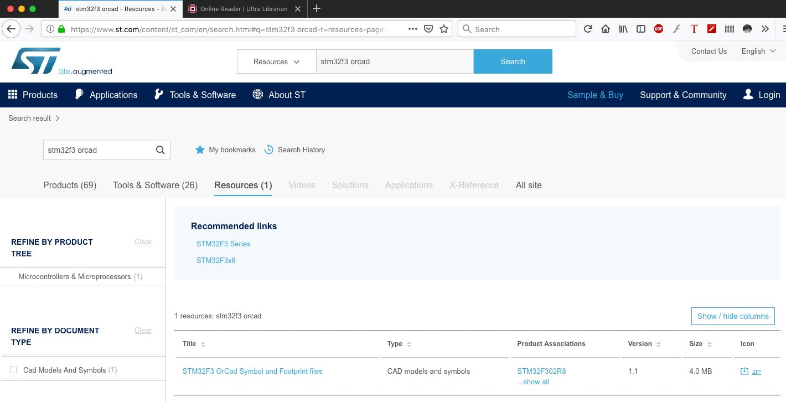
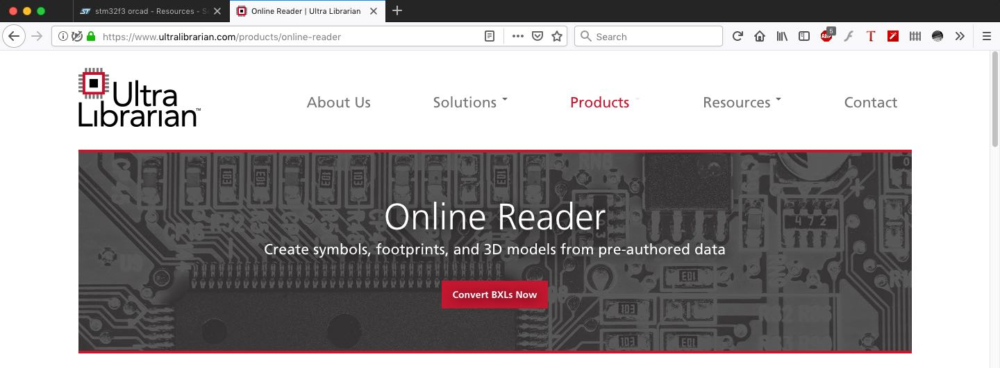
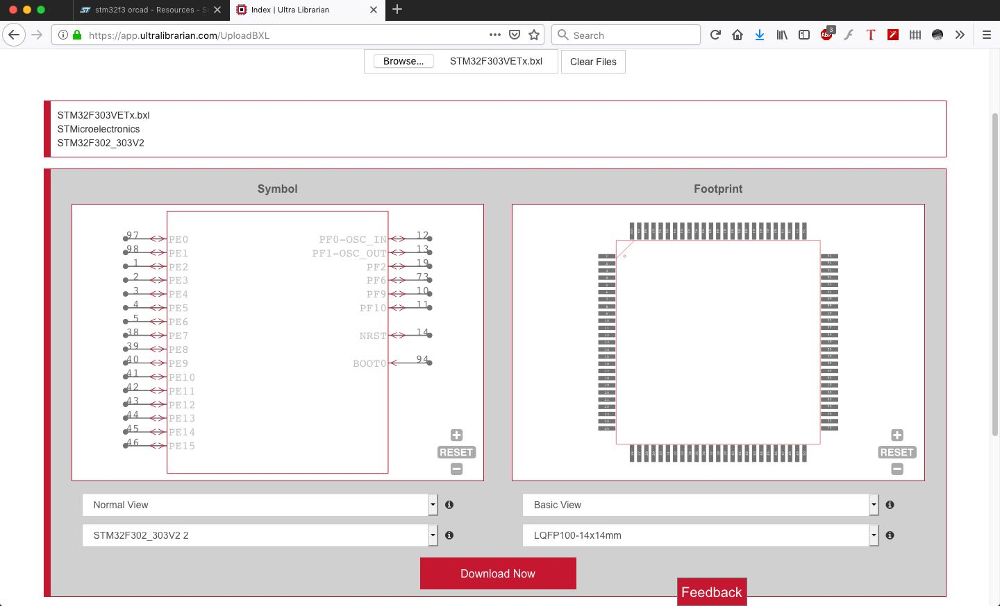
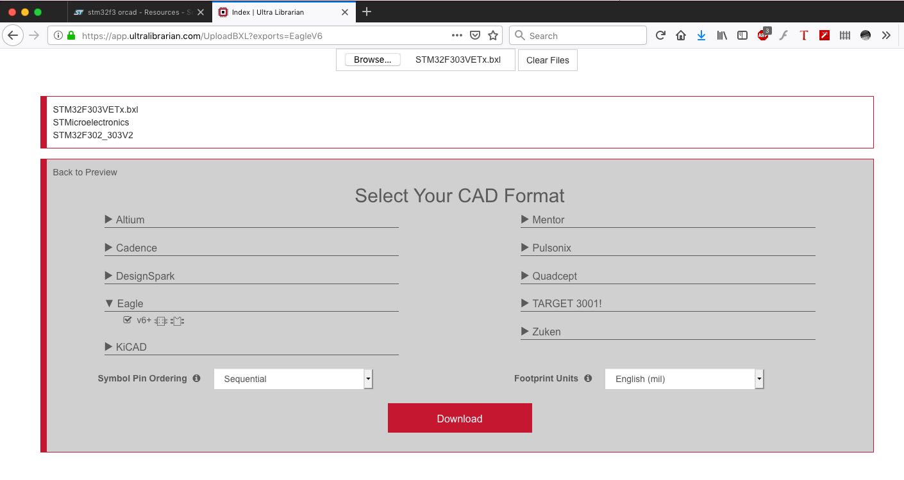
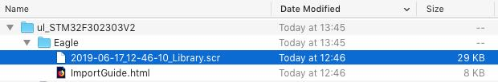
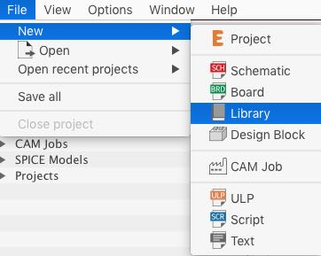
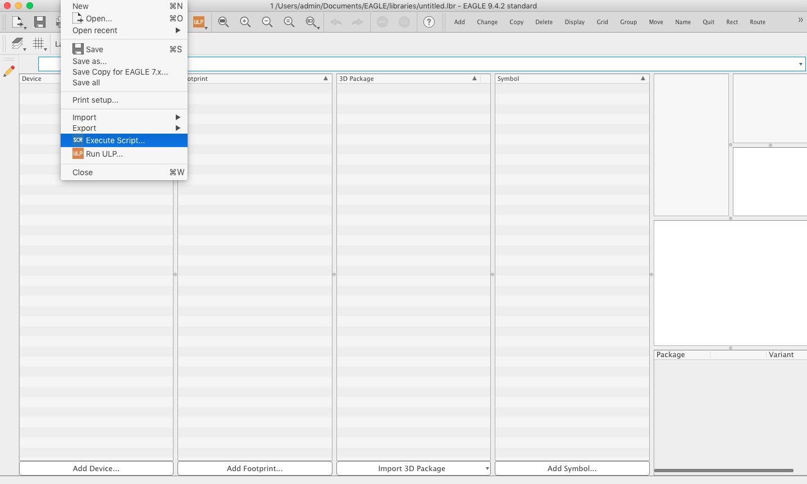
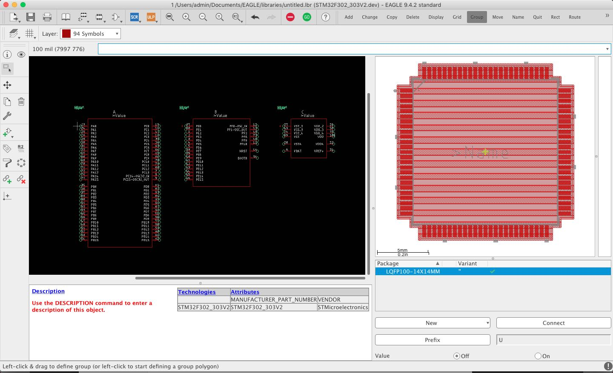

Getting STM32 CAD files, footprints and schematic objects, into EagleCAD.

- Navigate to https://www.st.com/
- Search the Resources section for the chip series, followed by "OrCad", like "STM32F3 orcad".
- Download the OrCad Symbol and Footprint files and unzip the file.

- Navigate to https://www.ultralibrarian.com/products/online-reader and go to 'Convert BXLs Now'.

- Upload the desired chip model BXL file.
- Go straight to Download Now.

- In the CAD Format selection, find Eagle and check the box for v6+, and download.

- You now have an EagleCAD .scr script file.

- Open Eagle and go to File > New > Library.

- At this window now go to File > Execute Script...

- Once the script is opened you should see appear the schematic, footprint and device in the library. The library can now be saved.

