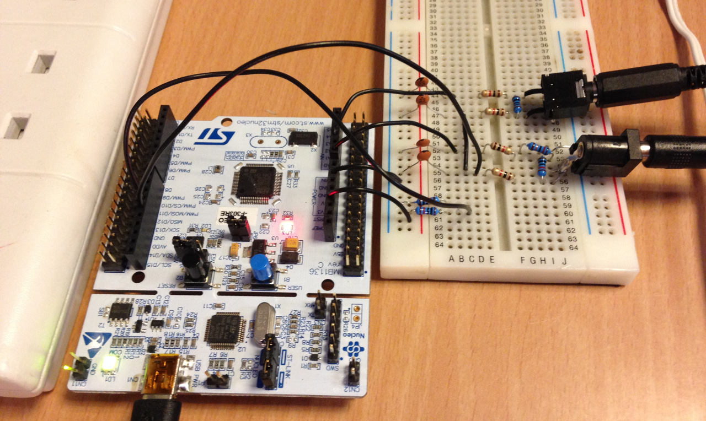
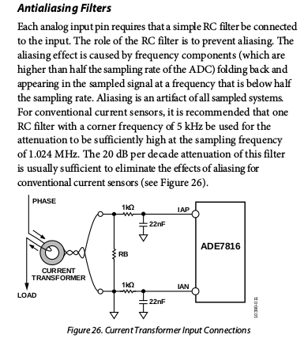

## Prototype 1: Voltage follower and anti-alias filter

Modifications to Emon2 example:

- Addition of voltage follower on PA6 & PA7
- HAL_OPAMP_Start(&hopamp2); required

Anti-alias filter based on: 

Two 1k resistors + 22pF capacitors to ground, biased with output from voltage follower.

Serial output (toaster):

    235.86  0.053   1.2     12.4    0.097   65380
    235.71  0.053   1.2     12.5    0.093   65383
    235.68  0.053   1.3     12.5    0.101   65390
    235.53  0.052   1.2     12.3    0.101   65402
    235.70  0.053   1.1     12.5    0.087   65424
    234.46  3.778   657.2   885.8   0.742   65435
    233.47  4.913   1144.2  1147.1  0.998   65448
    233.48  4.827   1124.3  1127.0  0.998   65468
    233.52  4.800   1118.0  1120.8  0.998   65467
    233.49  4.784   1114.2  1117.0  0.998   65467
    233.44  4.772   1111.3  1114.0  0.998   65475
    233.19  4.759   1107.0  1109.7  0.998   65476
    233.30  4.754   1106.4  1109.1  0.998   65480
    235.58  0.910   42.1    214.4   0.196   65474
    235.47  0.047   1.4     11.1    0.128   65465
    235.61  0.047   1.3     11.0    0.120   65452
    235.62  0.046   1.3     10.9    0.124   65458
    235.44  0.046   1.2     10.9    0.114   65464
    235.58  0.047   1.3     11.0    0.119   65467

