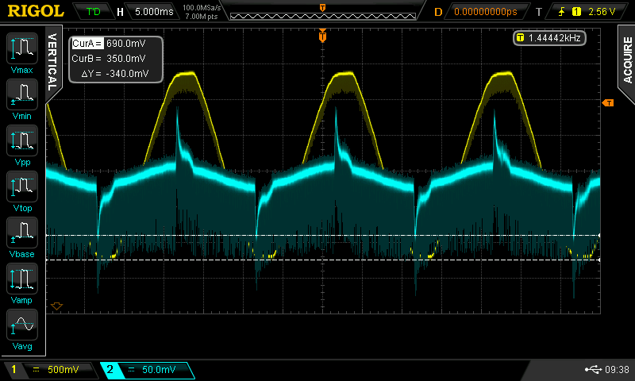
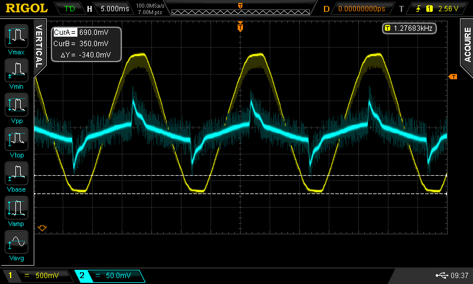
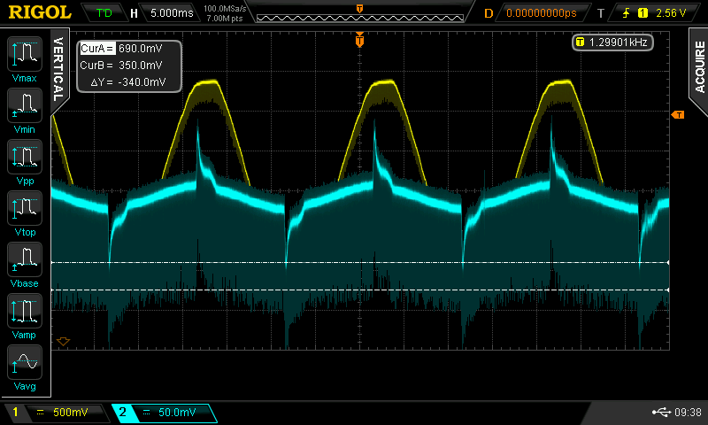
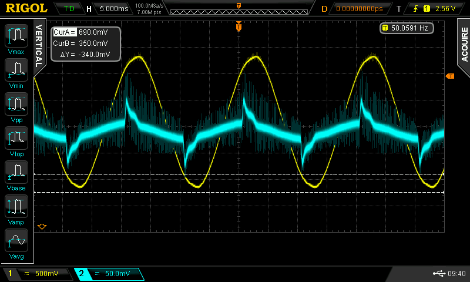

## Prototype 1: Voltage follower and anti-alias filter

[Emon3 Firmmware](https://github.com/TrystanLea/STM32Dev/tree/master/Emon3):

- Voltage follower on PA6 & PA7 for bias buffer (note: HAL_OPAMP_Start(&hopamp2); required)
- Implements @Robert.Wall's offset removal technique

Anti-alias filter based on: 

Two 1k resistors + 22pF capacitors to ground, biased with output from voltage follower.

40W incandescent lightbulb:

    Vrms    Irms    RP      AP      PF      Count
    237.94  0.185   43.5    44.0    0.988   163927
    238.05  0.186   43.6    44.2    0.985   161526
    238.05  0.185   43.5    44.1    0.987   167429
    238.01  0.185   43.6    44.1    0.990   175712
    238.08  0.185   43.5    44.1    0.986   175654
    238.06  0.186   43.5    44.2    0.984   172129
    238.08  0.186   43.6    44.2    0.986   167423

Readings are printed every ~2.5 seconds (125 cycles 50Hz), ~164000 VI sample pairs every 2.5s = 65.6 kHz

22pF filter cap on CT input:

100pF filter cap on CT input:

No filter cap on CT input:

100pF filter cap on Voltage input (22pF on other screenshots), showing to low cut off frequency:

