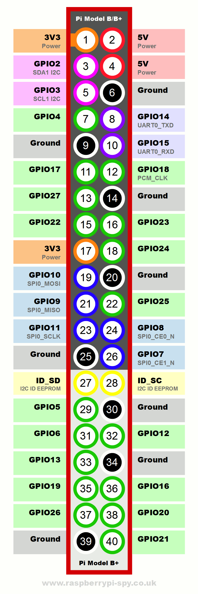
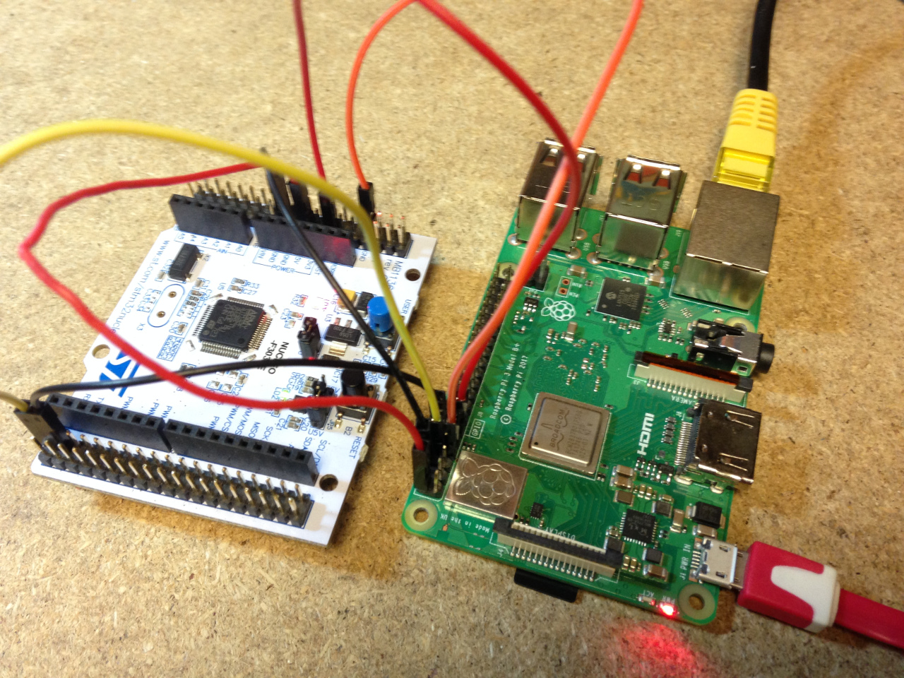

## Serial/UART Firmware Upload using RaspberryPi, auto boot0 & reset

NOTE: GPIO4 and GPIO17 are swapped around on development board.

The following example demonstrates serial firmware upload on a raspberrypi including automatic setting of boot0 to high and automatic reset to go in an out of firmware upload mode - making OTA firmware updates possible.

**RPI to Nucleo connections**

- Connect GND and 5V for power. 
- Connect UART2:PA2 to UART0_RXD (10:GPIO15)
- Connect UART2:PA3 to UART0_TXD (8:GPIO14)
- Connect BOOT0 to 7:GPIO4
- Connect NRST to 11:GPIO17

*UART1:PA9 & PA10 also work for upload, UART3 has a capacitor connected on the Nucleo development board stopping uart upload from working.*

Install toolchain on the RaspberryPi:

    sudo apt-get install gcc-arm-none-eabi

Install stm32flash on the RaspberryPi:

    sudo apt-get install stm32flash

The following example uses the ADC firmware example. Navigate to the ADC firmware folder, make using the makefile.

Create script called *upload.sh* with the following content:

    #!/bin/bash

    echo 17 > /sys/class/gpio/export
    echo out > /sys/class/gpio/gpio17/direction
    echo 1 > /sys/class/gpio/gpio17/value
    echo "boot0 high"
    sleep 0.2

    echo 4 > /sys/class/gpio/export
    echo out > /sys/class/gpio/gpio4/direction
    echo 0 > /sys/class/gpio/gpio4/value
    sleep 0.2
    echo 1 > /sys/class/gpio/gpio4/value
    echo "NRST"
    sleep 0.2

    stm32flash -w build/ADC.bin /dev/ttyAMA0 -b 115200

    sleep 0.2

    echo 0 > /sys/class/gpio/gpio17/value
    echo "boot0 low"
    sleep 0.2

    echo 0 > /sys/class/gpio/gpio4/value
    sleep 0.2
    echo 1 > /sys/class/gpio/gpio4/value
    echo "NRST"
    sleep 0.2

    echo 4 > /sys/class/gpio/unexport
    echo 17 > /sys/class/gpio/unexport

run with:

    sudo sh upload.sh
    
example output:

    boot0 high
    NRST
    stm32flash 0.5

    http://stm32flash.sourceforge.net/

    Using Parser : Raw BINARY
    Interface serial_posix: 115200 8E1
    Version      : 0x31
    Option 1     : 0x00
    Option 2     : 0x00
    Device ID    : 0x0446 (STM32F302xD(E)/F303xD(E)/F398xx)
    - RAM        : 64KiB  (6144b reserved by bootloader)
    - Flash      : 512KiB (size first sector: 2x2048)
    - Option RAM : 16b
    - System RAM : 8KiB
    Write to memory
    Erasing memory
    Wrote address 0x08003afc (100.00%) Done.

    boot0 low
    NRST

