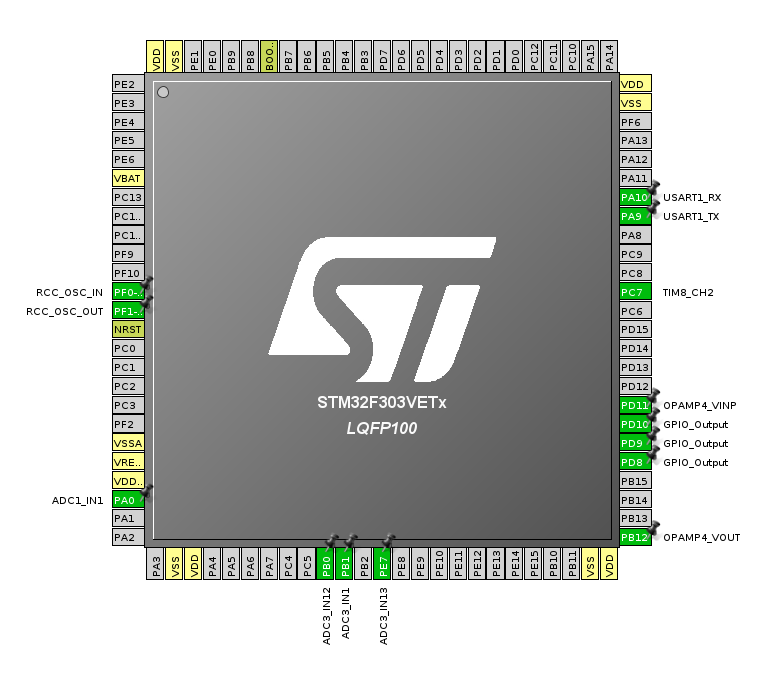

# Getting started with firmware development for stm32-pi_full

### 1. Blink

1\. Start STM32CubeMX

2\. Create new project

3\. Select STM32F303VETx LQFP100

4\. LED's are connected to PD8, PD9 & PD10, select these pins in the pinout view and set to GPIO_Output

5\. Open project settings. Name project. Select Makefile for Toolchain / IDE. On the Code Generator page: Copy only necessary, Generate peripheral initialisation, set all free pins as analog.

6\. Save and Generate Code.

7\. Add to Src/main.c:

    /* Infinite loop */
    /* USER CODE BEGIN WHILE */
    while (1)
    {
      HAL_GPIO_TogglePin(GPIOD, GPIO_PIN_8);
      HAL_GPIO_TogglePin(GPIOD, GPIO_PIN_9);
      HAL_GPIO_TogglePin(GPIOD, GPIO_PIN_10);
      HAL_Delay(200);
    /* USER CODE END WHILE */

    /* USER CODE BEGIN 3 */

    }
    /* USER CODE END 3 */
    
8. Compile and Upload

### 2. Serial Output

Follow guide here: https://github.com/openenergymonitor/STM32/blob/master/docs/Serial.md
 
But enable **USART1** RX and TX pins on PA10 and PA9 in the CubeMX pinout view rather than USART2.

### 3. Analog Read

Follow guide here: https://github.com/openenergymonitor/STM32/blob/master/docs/Analog.md

Analog inputs on STM32-pi full:

- VT1: PA0 ADC1
- VT2: PA1
- VT3: PF4
- CT1 -> CT9 BRD: PE13
- CT2 -> CT8 BRD: PE12
- CT3 -> CT7 BRD: PE11
- CT4 -> CT6 BRD: PE10
- CT5 -> CT5 BRD: PE9
- CT6 -> CT4 BRD: PE8
- CT7 -> CT3 BRD: PE7 ADC3_IN13
- CT8 -> CT2 BRD: PB1 ADC3_IN1
- CT9 -> CT1 BRD: PB0 ADC3_IN12

Add single-ended input on ADC1 PA0 corresponding to VT1. In the ADC1 Configuration tab set Rank > Sampling Time to 601.5 cycles. Generate Code. Add analog read function and print result following guide above.

### 4. Emon3CT_VET

3CT and ACAC firmware example for the STM32-pi board v0.7

- Using VT1: PA0 and CT1,2 & 3 which are atually inverted on the schematic so CT7:PE7 CT8:PB1 CT9:PB0.
- ADC and DMA configuration as given in original Emon3CT example
- Opamp follower for BIAS: OPAMP4_VINP: PD11, OPAMP4_VOUT: PB12
- Timer8 configuration

See firmware [Emon3CT_VET](../Emon3CT_VET)

