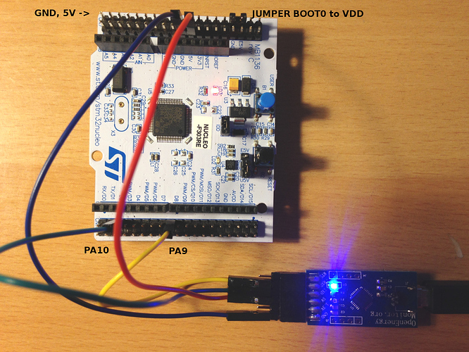

## Serial/UART Firmware Upload

A second firmware upload method is to use serial (UART) upload, which works in much the same way as the standard way of uploading code to an Arduino. Like in the case of the Arduino serial upload this approach relies on a pre-uploaded bootloader. My understanding is that the Nucleo boards already have this bootloader in place.

**UART to Nucleo connections**

- Connect GND and 5V for power. 
- Place a jumper between BOOT0 and VDD to select the serial upload mode.
- Connect PA9 to UART RX
- Connect PA10 to UART TX
- Power cycle to reset board and enter serial upload mode

**Serial Uploader Tool**

On Windows ST provide a tool for uploading firmware over serial called STM32-Flasher: http://www.st.com/en/development-tools/flasher-stm32.html

For Linux there is a neat command line tool called stm32flash available in the package manager: http://manpages.ubuntu.com/manpages/bionic/man1/stm32flash.1.html

It can be installed with the following apt-get install:

    sudo apt-get install stm32flash

I compiled the Arduino example Blink for the Nucleo64 STM32F303 using the Arduino IDE and then fetched the compliled .bin file from the /tmp folder that Arduino creates.

I could then upload to the STM32F303 by running:

    sudo stm32flash -b 115200 -w blink.ino.bin /dev/ttyUSB0 

Terminal output:

    $ sudo stm32flash -b 115200 w Blink.ino.bin /dev/ttyUSB0
    stm32flash 0.5

    http://stm32flash.sourceforge.net/

    Using Parser : Raw BINARY
    Interface serial_posix: 115200 8E1
    Version      : 0x31
    Option 1     : 0x00
    Option 2     : 0x00
    Device ID    : 0x0446 (STM32F302xD(E)/F303xD(E)/F398xx)
    - RAM        : 64KiB  (6144b reserved by bootloader)
    - Flash      : 512KiB (size first sector: 2x2048)
    - Option RAM : 16b
    - System RAM : 8KiB
    Write to memory
    Erasing memory
    Wrote address 0x08002c5c (100.00%) Done.
